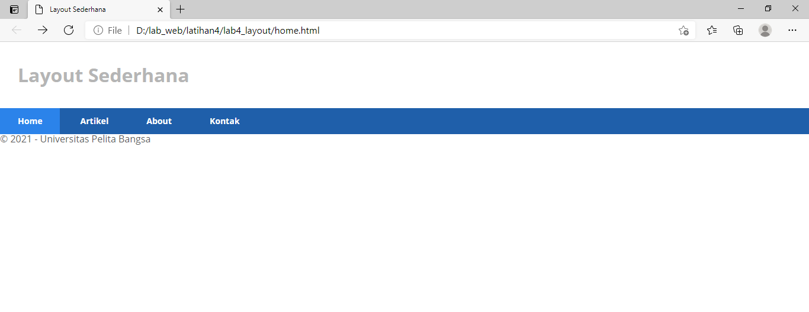
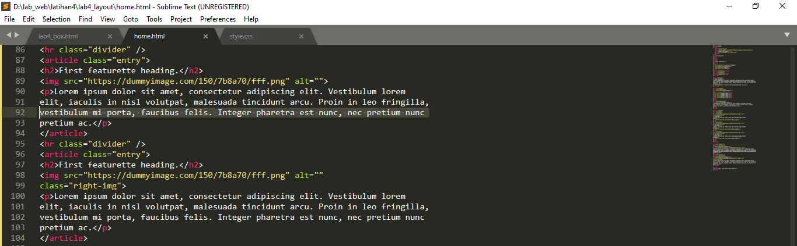

### LANGKAH - LANGKAH PRATIKUM

### Membuat Box Element
Tambahkan tag div

### CSS Float Property
Selanjutnya tambahkan deklarasi CSS pada head untuk membuat float element

Kemudian buka chrome untuk melihat hasilnya

### Membuat Layout Sederhana

Kemudian buka chrome dan liat hasilnya

Tambahkan kode CSS untuk membuat layoutnya.

Refresh chrome dan liat hasilnya.

### Membuat Navigasi

Refresh chrome dan liat hasilnya

### Membuat Hero Panel

Refresh chrome dan liat hasilnya

### Mengatur Layout Main dan Sidebar
 mengatur main content dan sidebar
 
 
 
 ### Membuat Sidebar Widget
Kemudian selanjutnya menambahkan element lain dalam sidebar.

Tambahkan CSS

Refresh chrome dan liat hasilnya

### Mengatur Footer
Selanjutnya mengatur tampilan footer.

Refresh chrome dan liat hasilnya

### Menambahkan Element Lainnya Pada Konten

Tambahkan CSS

Refresh chrome dan liat hasilnya

### Menambhakan Content Artikel
Tambahkan html pada main content

Tambahkan CSS

Refresh Chrome dan liat hasilnya

Pertanyaan dan Tugas
1. Tambahkan Layout untuk menu About
=> buat single layout yang berisi deskripsi, portfolio, dll
2. Tambahkan layout untuk menu Contact
=> yang berisi form isian: nama, email, message, dll

- Menu About

Input

- Menu Contact

Input

